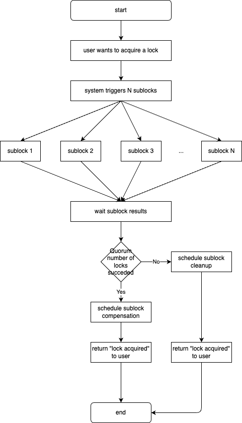

# Distributed Locking System (dls) Design Document

## General

The main goal of the system is to be highly available.

This will be achieved by making a number (N) of subsequent locks when the user tries to acquire a lock. When enough (quorum) number of subsequent locks are successfull, the user will get a response that the lock is successfully acquired.

## Terms

- _sublock_ - this is the simple lock that will be done when the end user requests to acquire a lock. To make it possible to implement some additional logic when acquiring/releasing _sublock_ it will be implemented in a separate component (service).
- _sublock storage_ - to make the _sublock_ service stateless, an external storage will be used to store the _sublocks_ that are acquired.
- _API_ - this is the component which will accept and serve the enduser requests to acquire/release locks.
- _lock_ - locks will be acquired/released by using an ID. Currently there will be no limitation on the lock ID.

## Algorythm

This is the initial version of the algorythm. It includes some techniques to make it work faster, but not all. It has some points of improvement, but they require more experience and understanding of the quorum algorythm and could be addressed later.

The main scenarios is when quorum number of locks are acquired successfully. From this point on, there are two branches:

- all the other sublocks are successfull. In this case no additional actions are performed.
- some of the other sublocks are not successfull. In this case the system should schedule some compensation logic so that the locks which are not successfull on the initial try are eventually put into target state. To make the system scalable, highly available and decoupled, this compensation logic should be executed asynchronously. A message should be sent to a message broker for each sublock that has to be compensated. The compensation logic itself will be described separately.

## Sublock results

- OK - this result is returned when the sublock is successfylly acquired.
- ALREADY_LOCKED - this result is returned when the sublock is already locked in the context of some other lock.
- FAILED - this result is returned when the sublock system encountered an issue when doing the sublock.

## Compensation logic

_sublock_ system will have APIs for two types of lock-related operations:

- regular lock operations - these operations should respect only the fact that the lock is already acquired by another lock operation.
- compensation lock operations - these operations should not respect if the lock is acquired or not by other lock operation. The only aspect that the compensation logic should respect is if the compensation logic is still relevant. Since the compensation logic is intended to be executed asynchronously, there is no guarantee that the compensation logic will be executed in the same order it was scheduled. This is why sublocks need to have timestamp which indicates when the sublock operation (lock or unlock) is scheduled. In other words, time will be taken as a common ground between the different components in the system (provided the clocks of all the components in the system are synchronized).

## Data model

The initial repesentation of a sublock was intended to be a simple entity with the ID of the sublock. With this aproach the existence of the entity will indicate a lock is acquired and its not existence indicates that a lock is NOT acquired. The limitation of this approach is that it does not provide a way to track when a lock was released. This is needed by the compensation logic - to check if the compensation logic is still relevant compared to a release of a sublock. This is why another approach will be applied.

_sublock_ will be represneted by an entity with the following fields:

- id
- status - locked/unlocked
- timestamp
- dateFlag - will be used for forther cleanup logic (will be later described). Will contain a simple representation of the current day in the form of YYYYMMDD. Example: 21.12.2023 will be repesented as 20231221 integer.
